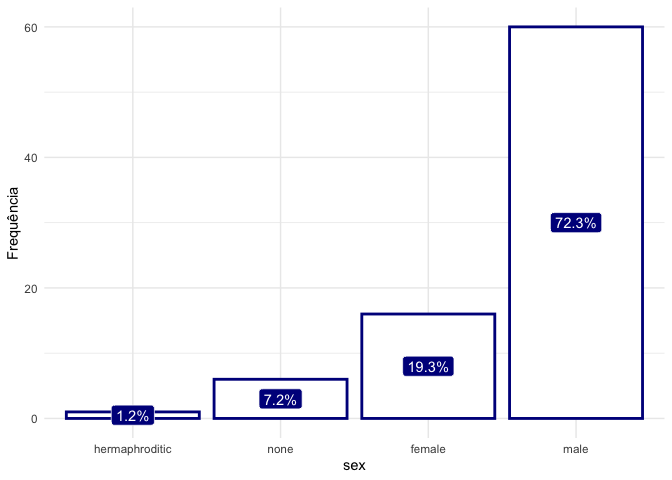
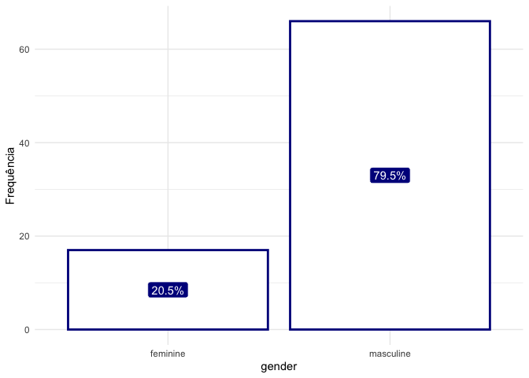
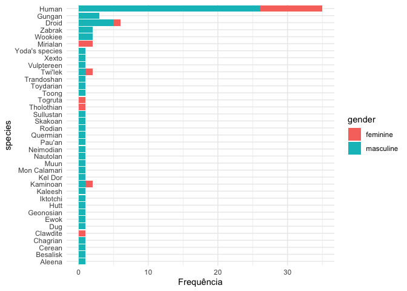
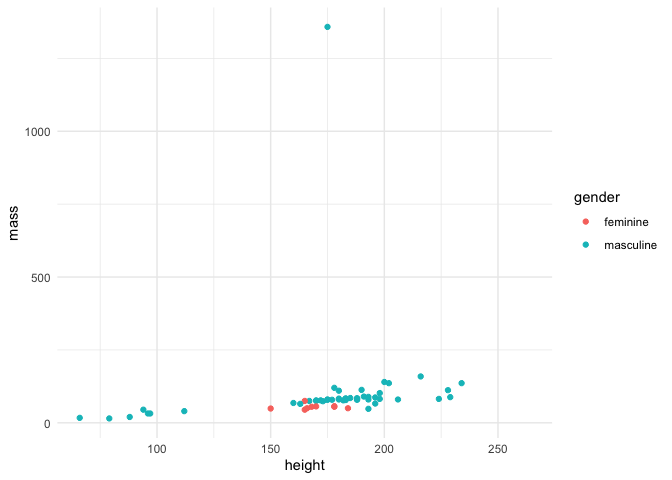
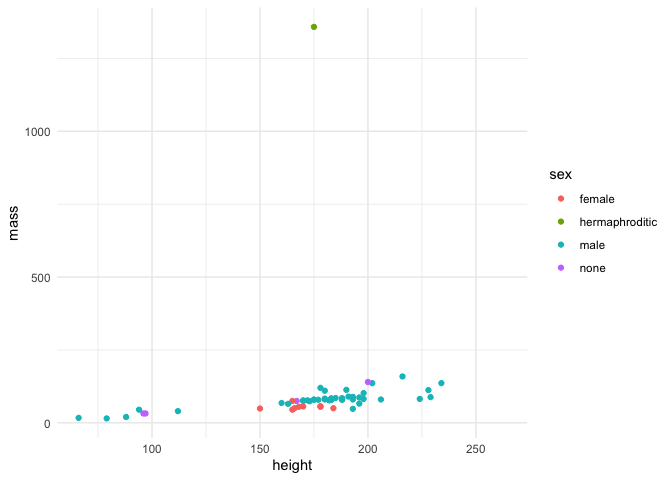

Análise Starwars
================
Rodrigo Almeida Figueira
4/9/2021

## Motivação

Exercício da aula 1 do curso de R para Ciência de Dados II, ministrado
pela [Curso-R](https://curso-r.com/).

## Objetivo

Os dados originais, do SWAPI, a API [Star Wars](https://swapi.dev/) ,
foram revisados para **refletir pesquisas adicionais sobre as
determinações de gênero e sexo dos personagens.**

## Base de dados Starwars

A base está contida no pacote `dplyr` e possui 87 linhas e 14 variáveis,
mas já vamos carregála em formato RDS após alguns tratamentos
feitos(retirada de missings das variáveis gênero e sexo). Com isso
temos:

``` r
# para acesso à base original `dplyr::starwars`

df <- rio::import("../data/starwars.rds")

skimr::skim(df) %>% knitr::kable()
```

| skim\_type | skim\_variable | n\_missing | complete\_rate | character.min | character.max | character.empty | character.n\_unique | character.whitespace | list.n\_unique | list.min\_length | list.max\_length | numeric.mean | numeric.sd | numeric.p0 | numeric.p25 | numeric.p50 | numeric.p75 | numeric.p100 | numeric.hist |
| :--------- | :------------- | ---------: | -------------: | ------------: | ------------: | --------------: | ------------------: | -------------------: | -------------: | ---------------: | ---------------: | -----------: | ---------: | ---------: | ----------: | ----------: | ----------: | -----------: | :----------- |
| character  | name           |          0 |      1.0000000 |             3 |            21 |               0 |                  83 |                    0 |             NA |               NA |               NA |           NA |         NA |         NA |          NA |          NA |          NA |           NA | NA           |
| character  | hair\_color    |          5 |      0.9397590 |             4 |            13 |               0 |                  11 |                    0 |             NA |               NA |               NA |           NA |         NA |         NA |          NA |          NA |          NA |           NA | NA           |
| character  | skin\_color    |          0 |      1.0000000 |             3 |            19 |               0 |                  31 |                    0 |             NA |               NA |               NA |           NA |         NA |         NA |          NA |          NA |          NA |           NA | NA           |
| character  | eye\_color     |          0 |      1.0000000 |             3 |            13 |               0 |                  14 |                    0 |             NA |               NA |               NA |           NA |         NA |         NA |          NA |          NA |          NA |           NA | NA           |
| character  | sex            |          0 |      1.0000000 |             4 |            14 |               0 |                   4 |                    0 |             NA |               NA |               NA |           NA |         NA |         NA |          NA |          NA |          NA |           NA | NA           |
| character  | gender         |          0 |      1.0000000 |             8 |             9 |               0 |                   2 |                    0 |             NA |               NA |               NA |           NA |         NA |         NA |          NA |          NA |          NA |           NA | NA           |
| character  | homeworld      |          9 |      0.8915663 |             4 |            14 |               0 |                  47 |                    0 |             NA |               NA |               NA |           NA |         NA |         NA |          NA |          NA |          NA |           NA | NA           |
| character  | species        |          0 |      1.0000000 |             3 |            14 |               0 |                  37 |                    0 |             NA |               NA |               NA |           NA |         NA |         NA |          NA |          NA |          NA |           NA | NA           |
| list       | films          |          0 |      1.0000000 |            NA |            NA |              NA |                  NA |                   NA |             24 |                1 |                7 |           NA |         NA |         NA |          NA |          NA |          NA |           NA | NA           |
| list       | vehicles       |          0 |      1.0000000 |            NA |            NA |              NA |                  NA |                   NA |             11 |                0 |                2 |           NA |         NA |         NA |          NA |          NA |          NA |           NA | NA           |
| list       | starships      |          0 |      1.0000000 |            NA |            NA |              NA |                  NA |                   NA |             16 |                0 |                5 |           NA |         NA |         NA |          NA |          NA |          NA |           NA | NA           |
| numeric    | height         |          5 |      0.9397590 |            NA |            NA |              NA |                  NA |                   NA |             NA |               NA |               NA |    174.08974 |   35.41046 |         66 |      166.25 |         180 |      191.00 |          264 | ▂▁▇▅▁        |
| numeric    | mass           |         25 |      0.6987952 |            NA |            NA |              NA |                  NA |                   NA |             NA |               NA |               NA |     98.16207 |  170.81018 |         15 |       56.40 |          79 |       84.75 |         1358 | ▇▁▁▁▁        |
| numeric    | birth\_year    |         41 |      0.5060241 |            NA |            NA |              NA |                  NA |                   NA |             NA |               NA |               NA |     88.17381 |  156.51443 |          8 |       34.00 |          50 |       72.00 |          896 | ▇▁▁▁▁        |

## Análise

Para esta análise, vamos gerar gráficos que indiquem a quantidade de
indivíduos por gênero e por sexo. Para isso, vamos carregar as funções
que fizemos do `ggplot`.

``` r
source("../R/ggplot_function_bar.R")

df %>%
  dplyr::count(sex) %>%
    dplyr::mutate(
      sex = forcats::fct_reorder(sex,n)
    ) %>%
      grafico_barras(x = sex, y = n)
```



Neste primeiro gráfico podemos perceber que o sexo masculino é
predominante entre os personagens do elenco de Starwars, tendo mais de
70% de represetatividade.

Vamos agora olhar o gênero destes personagens.

``` r
df %>%
  dplyr::count(gender) %>%
    dplyr::mutate(
      sex = forcats::fct_reorder(gender,n)
    ) %>%
      grafico_barras(x = gender, y = n)
```



Agora nós podemos notar que a grande maioria dos personagens pertencem
ao gênero masculino, quase 80%.

Vamos agora cruzar as espécies dos personagens com o gênero dos mesmos
utilizando uma função feita no `ggplot` para representar esta situação:

``` r
source("../R/grafico_bar_cores.R")
df %>%
  dplyr::count(gender, species) %>%
    dplyr::mutate(
      species = forcats::fct_reorder(species, n)
    ) %>%
      grafico_bar_cores(x = species, y = n, color = gender)
```



Neste gráfico, notamos que possúimos 37 espécies, sendo que apenas 8
espécies (21.6%) possuem representates do gênero feminino. O destaque
fica para a espécie *Human* (Humana), que, além de ser a mais populosa,
é onde o gênero feminino possui maior quantidade bruta de
representantes. Já na espécie *Mirialan*, só existem personagens do
gênero feminino, sendo a única espécie onde esta situação ocore. Para o
gênero contrário (Masculino), isso ocorre 29 vezes (78.4%).

Uma análise adicional é a de comparação do tamanho do personagem
(contando altura e peso) em relação ao gênero dos mesmos. Podemos fazer
isso também para o sexo, vendo como se comporta. Para isso, vamos
carregar a função do `ggplot` que nos mostra um gráfico de dispersão por
quebras selecionadas (neste caso o gênero e o sexo):

``` r
source("../R/ggplot_function_disp.R")
df %>%
  grafico_dispersao(x = height, y = mass, cores = gender)
```



Neste gráfico podemos perceber que o gênero masculino possui dimensões
de altura e peso maiores que o gênero feminino. Vamos observar por sexo
agora:

``` r
df %>%
  grafico_dispersao(x = height, y = mass, cores = sex)
```



Agora podemos notar que aquele que possui maior dimensões é um ser
hermafrodita, mas ainda sim, o sexo masculino possui, em sua maioria,
dimensões maiores que a dos outros sexos.

## Conclusão

No filme Starwars, nota-se que há uma grande representatividade
masculina, tanto para gênero quanto para sexo. Além disso, a maioria das
espécies dos personagens possuem papel masculino e dimensões de peso e
altura maiores para este gênero também. Numa próxima edição, seria bom
trabalhar a representattividade de gênero para que o filme, além de ser
um clássico das telas, traga um conteúdo social junto a toda esta fama\!
